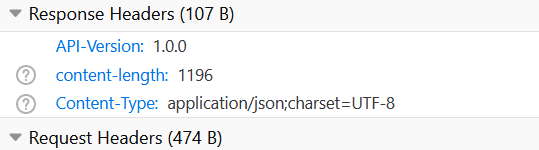
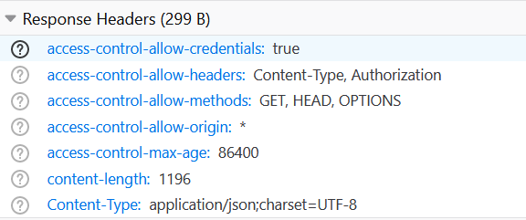

# Reproducer

call: `http://localhost:8080/reproducer/q/openapi.json`

### including properties:

```
quarkus.http.cors=true
quarkus.http.cors.methods=GET,POST
quarkus.http.cors.access-control-max-age=24H
```

Results in response headers:



### excluding the properties (and restarting):

```
#quarkus.http.cors=true
#quarkus.http.cors.methods=GET,POST
#quarkus.http.cors.access-control-max-age=24H
```
Results in:




### please note:

* The API-Version header has gone missing
* The CORS headers are suddenly included.

The test are ran from a local browser (Firefox, Windows machine). However, the same seems to be happening when I deploy my code inside an OpenShift cluster as image.

